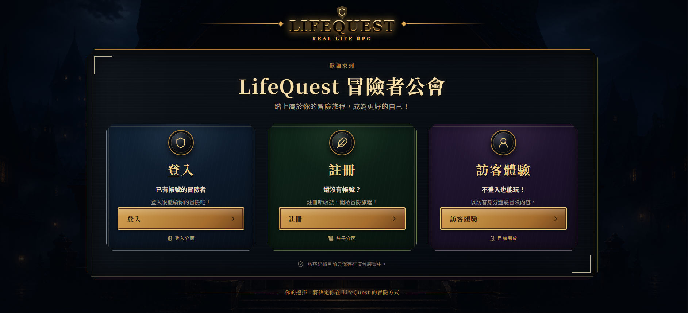
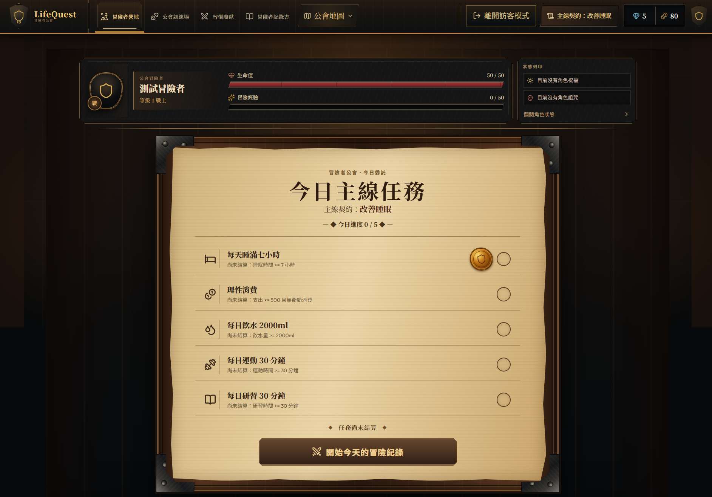
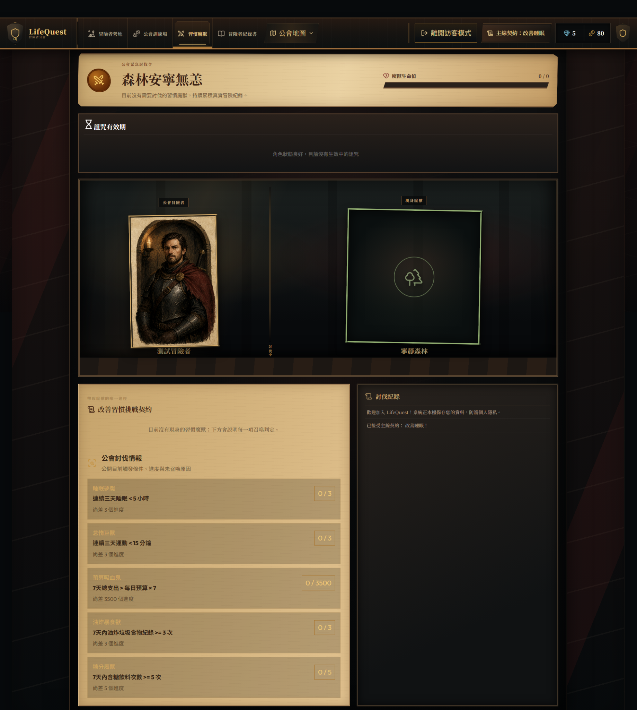
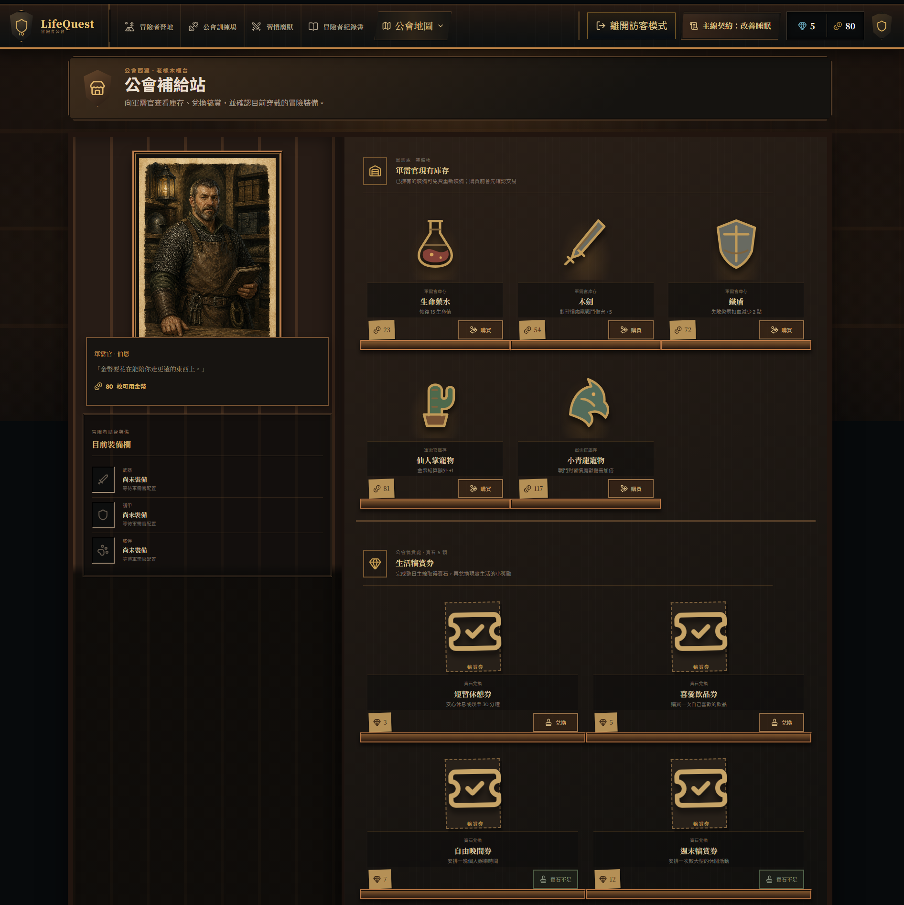

# LifeQuest — Real Life RPG

LifeQuest 是將日常生活管理 RPG 化的 Web Application：記錄睡眠、飲水、運動、學習與消費，透過現實中的行為推進任務、挑戰魔獸，累積角色成長。

本作品著重的不只是遊戲畫面，也包含本機／雲端資料隔離、Server-authoritative commands、交易一致性、重試安全與手機 RWD。

**Job Portfolio Demo V1** · ✅ Final Release Accepted · ✅ Portfolio V1 Complete

完成範圍為求職作品集 Demo；不代表 Production Ready、Enterprise Ready 或零風險。

## Live Demo

[開啟 LifeQuest](https://eloquent-quejadas-ffaea3.netlify.app)

- **Guest**：不需帳號即可體驗主要功能，進度保存在目前瀏覽器。
- **Member**：註冊自己的帳號，登入後使用 Cloud Save；不提供共用測試帳號。

## Screenshots

### 首頁

展示登入、註冊、Guest Mode 與 LifeQuest 的 RPG 入口。



### 冒險者營地

集中呈現「測試冒險者」的角色狀態、每日任務與主要冒險流程。



### 魔獸挑戰

展示尚未召喚魔獸時的狀態，以及各類習慣魔獸的觸發條件與進度。



### 公會補給站

展示 Gold／Gems、藥水與裝備商品、目前裝備欄及生活犒賞券。



## Core Features

### Guest Mode

LocalStorage 為權威存檔；支援 F5 還原、離開訪客後再次進入保留進度，與 Member Cloud Data 隔離。清除瀏覽器網站資料會失去本機存檔。

### Member Mode

Supabase Auth、Cloud Save、Session Restore 與帳號隔離；遊戲資源由 Server 決定，畫面套用 authoritative state。

### RPG System

主線任務、每日紀錄／結算、自訂習慣、EXP／多級升級、HP、健康／精力／財富／成長能力值、Buff／Debuff、Boss Challenge 與成就。精力（Energy）是能力屬性，不是額外的可消耗體力條。

### Economy

Gold 商品、Gems 自我犒賞券、背包、消耗品與武器／防具／寵物裝備。藥水購買後進背包，再另行使用；犒賞券可兌換、使用，未使用時可安全復原。

### Statistics

查看每日紀錄、週／月生活趨勢與角色相關統計，以 Chart.js 呈現圖表。分析提示採既有規則計算，並非外接 LLM 服務。

## Guest vs Member

| 項目 | Guest | Member |
| --- | --- | --- |
| 登入 | 不需要 | Supabase Auth |
| 遊戲資料權威來源 | LocalStorage | Supabase Cloud |
| F5 還原 | 讀取本機存檔 | Session Restore → Cloud Bootstrap |
| Cloud Save | 無 | 有 |
| 帳號／模式隔離 | 不自動匯入會員 | 依會員識別隔離，不讀 Guest 補資料 |

Member 的 Auth session、待確認 command journal 與導覽狀態仍可能使用瀏覽器 storage，但不是遊戲資源的權威來源。兩種模式不自動 merge；Member 連線失敗不會 fallback Guest。

## Tech Stack

| 層級 | 技術 |
| --- | --- |
| Frontend | HTML5、CSS Grid／Flexbox／media queries、Vanilla JavaScript |
| Browser libraries | Chart.js、Lucide、Supabase JS |
| Backend | Supabase Auth、PostgreSQL、RLS、Edge Functions、Transactional RPC |
| Server runtime | Edge 入口使用 TypeScript／Deno，Domain modules 使用 JavaScript |
| Testing / Tooling | Node.js、npm、內建 `node:test`／`assert`、Supabase CLI、release／secret-scan scripts |
| Deployment | Netlify 靜態網站、Supabase Backend |

前端不依賴 React、Vite 或 Webpack。

## Architecture

```text
Guest UI → Application Layer → LocalStorageRepository
                             → Local authoritative state
```

```text
Member UI → GameApplication → RemoteCommandRepository
          → Supabase transport → lifequest-command Edge Function
          → Transactional RPC → PostgreSQL
          → Authoritative projection → Member UI
```

### Engineering Highlights

- **Server Authority / Atomicity**：Client 提交行為與操作意圖；Server 計算／驗證結果。會員 mutation 的 domain writes、資源、ledger、receipt 與版本在同一 DB transaction 成功或回滾。
- **Idempotency**：`operationId` 識別同一操作；unknown-result retry 沿用原 ID，避免重複扣款或發獎。相同 ID 換 payload 會被拒絕。
- **Optimistic Concurrency**：以 `expectedVersion` 防止舊資料覆寫新狀態。`VERSION_CONFLICT` 後重新取得 Cloud state，由使用者確認新操作，不自動重送交易。
- **Snapshot Fence**：Bootstrap 比對 projection 讀取前後的 `repositoryVersion`；不一致就丟棄整份資料，最多嘗試 3 次，仍不穩定則安全失敗。
- **Isolation / Session Safety**：RLS、RPC 權限與 ownership validation 限制跨帳號存取；帳號切換防止舊 response 污染新會員，Offline reload 保留最後成功的 Member projection。
- **Release Security**：allowlist 產生乾淨 `dist/`，搭配 secret scan、HTTPS、CSP、`frame-ancestors`、X-Frame-Options、nosniff、Referrer-Policy 與 Permissions-Policy。現有 CSP 為相容 inline code 保留 `unsafe-inline`，不是全面禁止 inline 的嚴格政策。

實作細節見 [Backend Integration](BACKEND_INTEGRATION.md)；公開設定與私密憑證必須分開，service-role／DB 密碼不得進入 Browser 或 Repo。

## Testing

以下是 Portfolio V1 已完成的驗收證據，不是測試覆蓋率，也不代表每項都是線上 E2E：

| 驗證階段 | Passed | Failed | Skipped |
| --- | ---: | ---: | ---: |
| Final Release Setup 完整基準 | 548 | 0 | 0 |
| Final read-only review（唯讀測試集合） | 541 | 0 | 0 |

另外 7 項 Release Artifact tests 會重建 `dist/`，因此最終唯讀審查未重新執行；它們已包含在先前通過的 548 項完整基準。上述數字是既有驗收紀錄，不宣稱目前每次執行或每次 push 都有同樣結果。

測試涵蓋 Domain／Contract、Guest／Member 隔離、Session／Account Switch、Idempotency／Concurrency、Snapshot Fence、Economy、RWD 與 release 安全；真實 Supabase A/B 驗證另有 runner，需獨立授權、臨時帳號與清理流程，不隨一般 `npm test` 執行。

## Local Development

本機驗證使用 Node.js 24.18.0。取得專案後，在包含 `package.json` 的根目錄執行：

```bash
npm ci
npm run serve
```

開啟 [http://127.0.0.1:4173](http://127.0.0.1:4173)。Guest 可直接體驗；Member 使用 `supabaseConfig.js` 指定的 Cloud Backend，`npm ci` 不會自動建立一套本機 Supabase。

若要獨立架設 Backend，需另行設定自己的 Supabase project、Auth、migrations 與 Edge Functions，並更新 browser-safe runtime config。請先閱讀 [Backend Integration](BACKEND_INTEGRATION.md)，不要對現有 Demo DB 盲目重播 migration，也不要將 server-only credentials 放進前端設定。

```bash
npm run check          # 語法檢查，不等同完整測試
npm test               # 完整自動化 suite；包含會重建 dist 的 release tests
npm run release        # 依 allowlist 建立並驗證 dist
npm run release:verify # 唯讀驗證現有 dist
```

GitHub 保存完整工程 source、tests 與 Supabase source；Netlify 僅發布生成的 `dist/`，不要部署整個 Repo root。`dist/` 已由 `.gitignore` 排除；HTML 與未 hash 的 JS／CSS 使用 revalidation，不設永久 immutable cache。

## Known Limitations / Roadmap

- Daily Correction 目前採「修改 → 保存 → 蓋章」流程，直接提交更正仍有已知 UX 限制。
- Portfolio Demo 不涵蓋完整 production Auth 流程；Confirm Email、Recovery／SMTP、OAuth／MFA、Leaked Password Protection 與更嚴格 CSP 留待後續強化。平台管理的 default privileges 風險與處理邊界見 Backend 文件，不代表已全面解決。
- 專案尚未選定整體 License；素材再利用條件與部分第三方 notice 仍待確認，不宣稱所有素材可自由重用。詳見 [Attribution Inventory](docs/ATTRIBUTION_INVENTORY.md)。

更多工程與驗收背景：[Backend Integration](BACKEND_INTEGRATION.md) · [Release Readiness](RELEASE_READINESS.md) · [Project Context](CONTEXT.md) · [Art Direction](ART_DIRECTION.md)。
